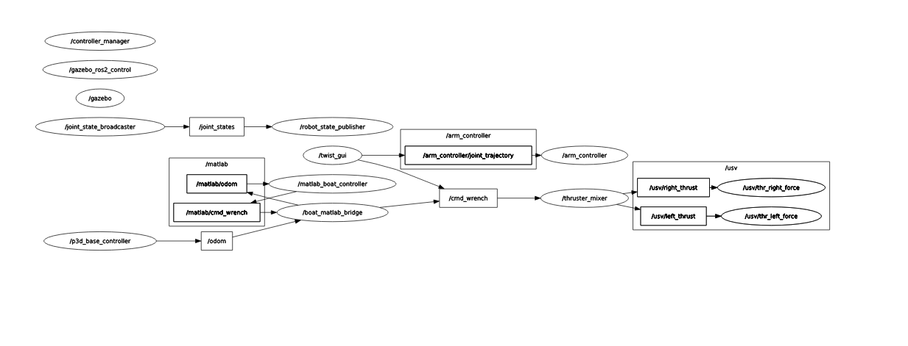

# USV with 5-DOF Arm: A ROS 2 Simulation Project

This repository contains the source code for a semester project in the course **ELE306 - Robotics** at the **Western Norway University of Applied Sciences (HVL)**.

The project consists of a complete ROS 2 (Foxy) and Gazebo simulation of an Unmanned Surface Vehicle (USV) equipped with a 5-DOF robotic arm. It features independent control systems for both the vehicle's navigation and the arm's manipulation tasks.

## Features

-   Gazebo simulation of a USV in an ocean environment with buoyancy dynamics.
-   A 5-DOF robotic arm mounted on the USV.
-   Autonomous path-following control for the USV implemented in MATLAB.
-   Dual-method robot arm control:
    1.  Precise, multi-point trajectory execution via MATLAB scripts.
    2.  Interactive jogging and control via a Python-based GUI.
-   A waypoint generation tool integrated into the GUI to assist in creating MATLAB trajectory scripts.
-   A modular system architecture with clear separation of concerns between navigation, manipulation, and hardware abstraction.

## System Architecture and Functionality



The robot's control system is divided into two main parts: the USV base and the robotic arm.

### USV Control

The USV's navigation is handled by an external MATLAB script that performs autonomous path-following.

-   **State Feedback:** A Gazebo plugin publishes the boat's position and orientation to the `/odom` topic. The `boat_matlab_bridge` node subscribes to this data and republishes it onto the `/matlab/odom` topic for the MATLAB controller.
-   **Command Flow:** The MATLAB script calculates the required throttle (force) and turn (torque) and publishes them as a `geometry_msgs/WrenchStamped` message to `/matlab/cmd_wrench`. The `boat_matlab_bridge` forwards this message to the `/cmd_wrench` topic, which is read by the `thruster_mixer` node. The mixer then converts these high-level commands into individual forces for the left and right thrusters in the simulation.

### Robot Arm Control

The robotic arm can be controlled via two distinct methods, providing both precision and ease of use.

-   **Method 1: MATLAB Trajectory Script:** For executing complex, pre-defined trajectories, a MATLAB script (`control_arm_trajectory.m`) acts as a ROS 2 action client. It sends a `FollowJointTrajectory` goal to the `/arm_controller/follow_joint_trajectory` action server, which allows for precise, timed movements through multiple waypoints.
-   **Method 2: Interactive GUI:** For interactive control, the `twist_gui` provides sliders for each of the arm's joints. Moving a slider sends a simple, single-point trajectory to the `/arm_controller/joint_trajectory` topic for immediate feedback and jogging. The GUI also includes a feature to record a sequence of these positions into a MATLAB-compatible matrix, simplifying the process of creating new trajectory scripts.

For a detailed guide on using both arm control methods, see **`matlab_control_guide.md`**.

## Setup and Usage
This project requires [buoyancy_plugin](https://github.com/Z3bzi/buoyancy_plugin) for simulated hydrodynamics in Gazebo.

### 1. Build the Workspace

First, ensure you are in your ROS 2 workspace and build the `usv_package`.

```bash
cd /home/rocotics/ros2_ws
colcon build --packages-select usv_package
source install/setup.bash
```

### 2. Launch the Simulation

Run the main launch file to start Gazebo and all the required ROS 2 nodes.

```bash
ros2 launch usv_package full_Launch.launch.py
```
This will start:
-   Gazebo with the ocean world.
-   The `robot_state_publisher` and `joint_state_broadcaster`.
-   The `thruster_mixer` for USV control.
-   The `boat_matlab_bridge` for MATLAB communication.
-   The interactive `twist_gui`.

### 3. Run the Controllers

With the simulation running, you can use one of the MATLAB scripts to control the robot.

-   **To control the boat's path:** Open and run `simulate_boat_master_liveplots_current.m` in MATLAB.
-   **To control the arm with a trajectory:** Open and run `control_arm_trajectory.m` in MATLAB.
-   **To control the arm interactively:** Use the sliders in the `twist_gui` window that appears after launching the simulation.
